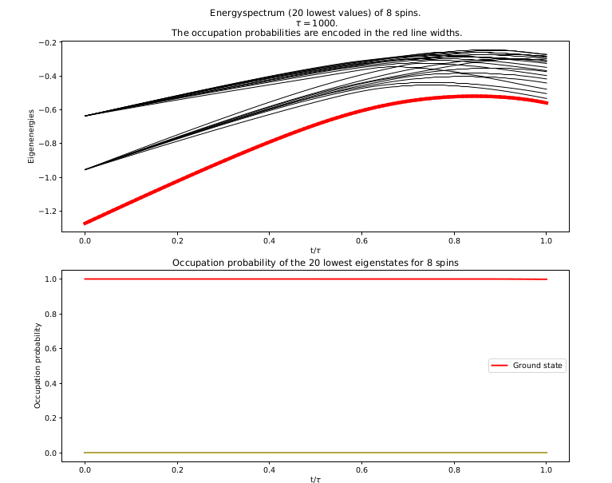
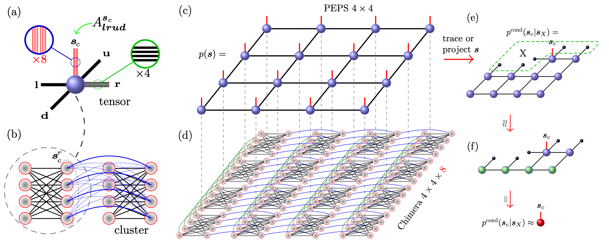
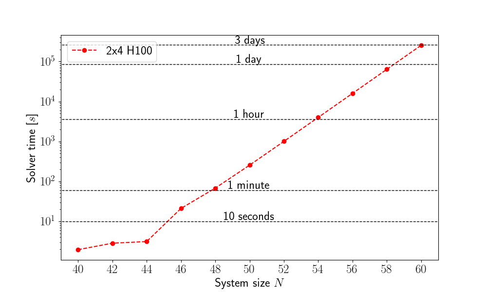

# Quantum annealers 101

## Annealers as coprocessor for optimization

:::: {.columns}

::: {.column width="50%"}

Goal: Minimize $H(\mathbf{s})$ as given below

$$\scriptsize\begin{eqnarray}
&H(\mathbf{s}) = \textstyle\sum_{i=1}^N h_i s_i + \sum_{<i, j>}J_{ij} s_i s_j\\
&s_i \in \{-1, 1\} \quad
h_i, J_{ij} \in \mathbb{R}
\end{eqnarray}
$$

:::

::: {.column width="50%"}

$$
\scriptsize
\begin{eqnarray}
&u = t/\tau\\
&H_{\tiny \mbox{ D-Wave}}(u) = A(u) H_0 + B(u) H
\end{eqnarray}
$$

:::

::::

## Example of evolution

## Example of evolution

## Example of evolution

## Chimera topology

## Minor embedding

## Pegasus topology

## Zephyr topology

# Solving spin-glass problems using tensor networks

---

:::: {.columns}

::: {.column width="50%" style="font-size:0.8em"}

### Motivation

- Apply methods from solid-state physics to construct novel algorithm for solving spin-glass problems.
  - Can exploit limitted connectivity (topology) of the annealer.
  - How would such algorithms compare to the real physical device?
:::

::: {.column width="50%"}

:::

::::

## Branch and bound

{style="width:80%"}

## Construction of PEPS tensor network

::: {.notes}
Mention compression
:::

## Comparison with other heuristics

## Package architecture

:::: {.columns}
::: {.column width=48%}
### SpinGlassTensors.jl
- Tensor structures
- Operations on tensors
- GPU utilization
:::

::: {.column width=48%}

:::
::::

## Package architecture

:::: {.columns}
::: {.column width=48%}
### SpinGlassNetworks.jl
- Graph storage and manipulation
- Abstract graph structures
- Basic I/O
:::

::: {.column width=48%}

:::
::::

## Package architecture

:::: {.columns}
::: {.column width=48%}
### SpinGlassEngine.jl
- Main algorithms
- Efficient simulation of Chimera topology
- Simulation of more complex graphs: Pegasus and Zephyr
:::

::: {.column width=48%}

:::
::::

## It's FOSS!

:::: {.columns}
::: {.column width=48%}
- https://github.com/euro-hpc-pl/SpinGlassPEPS.jl
- `]add SpinGlassPEPS`
:::

::: {.column width=48%}

:::
::::

# Brute-forcing spin-glass problems using CUDA

---

## Motivation

- Create a way for benchmarking other heuristic algorithms.
  - Can certify solution.
  - In fact, can compute exact low energy spectrum.
  - Easily parallelizable on CUDA-enabled GPUs.
- The goal: create the fastest brute-force solver on the market.

## General idea

## Key obstacles

- How to distribute work among threads?

  **Naive solution**: process states in chunks, map one state in chunk to one thread.

  **Better solution**: use strided loop to allow fine-tuning kernel parameters.

- How to compute energies?

  **Naive solution**: Compute each energy separately.

  **Better solution**: Iterate states in particular order to exploit regularities.

## Initial benchmarks

## Improvements of the algorithm
- Instead of natural order, enumerate states in Gray-code order.
- Consecutive numbers differ with one bit $\rightarrow$ significantly simpler energy update.
- Regularities in Gray code can be exploited to build cache of partial updates.
- Some common computations can be extracted to CPU, and the CPU-GPU work can be overlapped.

## Benchmarks of the improved version

## Distributed idea

## Benchmarks of the **distributed** version version

# Simulated bifurcation machines

## General principle

Consider equations of motion
$$
y_i(t_{k+1}) = y_i(t_k) + \left\{ -\left[ a_0 - a(t_k) \right]x_i(t_k) + c_0 \sum_{j=1}^N  J_{ij} \mathrm{sgn}\left[x_j(t_k)\right] \right\} \Delta_t
$$
$$
x_i(t_{k+1}) = x_i(t_k) + a_0 y_i(t_{k+1}) \Delta_t
$$
where $a(t)$ increses from zero to one.
At the end set
$$
s_i = \mathrm{sgn}(x_i)
$$

## Comparison to TN

# Summary

## Contributions

- Design and implementation of strategies for testing quantum annealers and beyond.
- Benchmarking them on the available annealing devices.
- Development of classical algorithms for solving spin-glass problems.

## What's the current state of quantum annealers?

- Current generation of D-Wave annealers underperforms in both academic and real-life applications, as compared to classical heuristics.
- There are noticeable improvements in newer generations of annealers.
  - If this trend continues, at some point the annealers may deliver the promised advantage in certain optimization problems.
  - Hard to predict when this could happen.
- Biggest advantage of quantum annealers so far: fueling development of classical algorithms either inspired by the annealers (e.g. tensor-network based), or designed to benchmark them (e.g. bruteforce algorithm).
- ML?

# Thank you for your attention!
