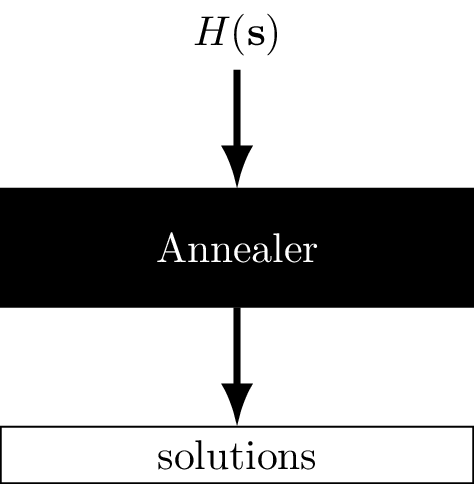

# Quantum annealers 101

## Annealers as coprocessor for optimization

:::: {.columns}

::: {.column width="50%"}

Goal: Minimize $H(\mathbf{s})$ as given below

$$\scriptsize\begin{eqnarray}
&H(\mathbf{s}) = \textstyle\sum_{i=1}^N h_i s_i + \sum_{<i, j>}J_{ij} s_i s_j\\
&s_i \in \{-1, 1\} \quad
h_i, J_{ij} \in \mathbb{R}
\end{eqnarray}
$$

:::

::: {.column width="50%"}

$$
\scriptsize
\begin{eqnarray}
&u = t/\tau\\
&H_{\tiny \mbox{ D-Wave}}(u) = A(u) H_0 + B(u) H
\end{eqnarray}
$$

:::

::::

## Topology

## Minor embedding

# Simulating quantum systems with quantum annealers

## Motivation

Simulating dynamics of quantum systems is the original goal of quantum computing, and a holy grail of computational physics.

- Can quantum annealers achieve this goal?
- If so - to what extent?
- If not - why, and how far are they?

---

## Problem definition

Given an operator $K$ acting on $\mathbb{R}^L$ and a dynamical system described by Schrödinger-like equation

$$
 \frac{\partial \ket{\psi(t)}}{\partial t} = K(t) \ket{\psi(t)}.
$$

find the system state $\ket{\psi(t)}$ for given time points $t_0 < t_1 < \ldots < t_N$.

- In particular, setting $K = \frac{i}{h} H$ gives Schrödinger equation.
- Complex systems can be converted to real ones using standard embedding.
---

## Key problems

- Static vs. dynamic (temporal) problems.

  **Solution:** enlarging Hilbert space so that it encodes temporal information.
- Dichotomous vs. continuous variables.

  **Solution:** encoding coefficients of the system as fixed-point numbers.
- Limitation of number of qubits/sparsity of topology.

  **Implication**: Only small problem instances can be solved.

::: {.notes}
- Mention fixed point vs floating point
:::
---

## Experimental setup

The system used for testing: single qubit system driven by the Hamiltonian

$$
\mathcal{H} = \frac{\pi}{2} \hat{\sigma}_y \quad \quad \ket{\psi(t)} = \exp(-i\mathcal{H}t) \ket{\psi(0)}
$$

with $\ket{\psi_0} = \ket{0}$.

- Exhibits oscillations, a fundamental phenomenon in physics.
- Purely real evolution $\rightarrow$ no need for complex-to-real embedding.
- Parameters used:
  - $R=2$ bits of fixed point precision.
  - $N=6$ (integral) time points.
---

## Results

{width=80%}

# Solving spin-glass problems using tensor networks

---

:::: {.columns}

::: {.column width="50%" style="font-size:0.8em"}

### Motivation

- Apply methods from solid-state physics to construct novel algorithm for solving spin-glass problems.
  - Can exploit limitted connectivity (topology) of the annealer.
  - How would such algorithms compare to the real physical device?
:::

::: {.column width="50%"}

:::

::::

## Branch and bound

{style="width:80%"}

## Construction of PEPS tensor network

::: {.notes}
Mention compression
:::

## Comparison with other heuristics

# Brute-forcing spin-glass problems using CUDA

---

## Motivation

- Create a way for benchmarking other heuristic algorithms.
  - Can certify solution.
  - In fact, can compute exact low energy spectrum.
  - Easily parallelizable on CUDA-enabled GPUs.
- The goal: create the fastest brute-force solver on the market.

## Key obstacles

- How to distribute work among threads?

  **Naive solution**: process states in chunks, map one state in chunk to one thread.

  **Better solution**: use strided loop to allow fine-tuning kernel parameters.

- How to compute energies?

  **Naive solution**: Compute each energy separately.

  **Better solution**: Iterate states in particular order to exploit regularities.

## Initial benchmarks

## Improvements of the algorithm

- Instead of natural order, enumerate states in Gray-code order.
- Consecutive numbers differ with one bit $\rightarrow$ significantly simpler energy update.
- Regularities in Gray code can be exploited to build cache of partial updates.
- Some common computations can be extracted to CPU, and the CPU-GPU work can be overlapped.

## Benchmarks of the improved version

# Railway conflict managemenet

---

## Motivation

- How do annealers perform on a problem that doesn't neccessary require finding the ground state?
- Do newer generations of quantum annealers offer any performance improvements?

## Example line segment {.smaller}

:::: {.columns}
::: {.column width="45%"}

:::
::: {.column width="45%"}

:::
{style="width: 65%"}
::::

---

:::: {.columns}
::: {.column width="50%"}
### Results

- DW 2000Q series annealers were not able to find a feasible solution at all.
- Newer annealers found significant number of feasible solutions.
  - Although best parameters for each annealer varied greately.
- Overall the best performing device turned out to be Advantage2 Prototype1.1.
:::
::: {.column width="50%"}

:::
::::

# Summary

## Contributions

- Design and implementation of two strategies for testing quantum annealers.
- Benchmarking both of them on the available annealing devices.
- Development of two classical algorithms for solving spin-glass problems.

## What's the current state of quantum annealers?

- Current generation of D-Wave annealers underperforms in both academic and real-life applications, as compared to classical heuristics.
- There are noticeable improvements in newer generations of annealers.
  - If this trend continues, at some point the annealers may deliver the promised advantage in certain optimization problems.
  - Hard to predict when this could happen.
- Biggest advantage of quantum annealers so far: fueling development of classical algorithms either inspired by the annealers (e.g. tensor-network based), or designed to benchmark them (e.g. bruteforce algorithm).

# Thank you for your attention!

# Responses to the reviewers

## Odpowiedź dla dra hab. Jakuba Spiechowicza

> Niewielkim mankamentem dysertacji jest jej oszczędne podsumowanie, w którym autor nie analizuje roli uzyskanych rezultatów w szerszym kontekście obecnych prototypów komputerów kwantowych i ich zastosowań oraz nie wytycza przyszłych kierunków badań. Sądzę, że np. dyskusja *quo vadis* kwantowe wyżarzanie zwłaszcza w kontekście zataczającego coraz szersze kręgi uczenia maszynowego byłaby interesującym zwieńczeniem pracy.

## Odpowiedź dla dra hab. Jakuba Spiechowicza

- Przedstawione w pracy badania świadczą o tym, że wyżarzacze kwantowe nie są w stanie samodzielnie rozwiązywać ważnych problemów optymalizacyjnych.
  - Ta sytuacja może się zmienić w przyszłości, ale nie jest to coś czego można się spodziewać w najbliższym czasie.
- Zastosowań wyżarzaczy można upatrywać w hybrydowych algorytmach, w których wyżarzacze kwantowe służą jedynie jako komponent sieci neuronowych.

---

---

---

## Response to dr Łukasz Cincio

> The analysis there is very
valuable but I will mention as a minor comment that this part of the thesis might benefit from including a scaling analysis. The author does not discuss resource requirements needed for solving more complicated problems, like those defined on larger number of qubits or those that require higher precision. It would be interesting to know at what scale (number and quality of uqubits) the method can compete with gate-based quantum computers on simulating dynamics.

## Response to dr Łukasz Cincio {.smaller}

- The logical number of qubits scales as
$$
\mbox{\#qubits} = N\cdot L \cdot R
$$
where $N$ is the number of time points, $L$ is the system size, and $R$ is the number of bits in fixed point approximation.
- The density of the resulting problem graph is nontrivial, and on average is increasing in $R$ and decreasing in $L$.
- Example:
  - 10 time points for 2 qubit system with $R=6$ bits of precision would require $240$ logical qubits.
  - Assuming clique embedding is used, this would require $Z_8$ (8448 qubits) or $C_{30}$ (28800 qubits).
  - As for other parameters - it would seem that DAC quantization errors would have to decrease to allow any reasonable $R$.

## Odpowiedzi dla dra hab. inż. Pawła Gepnera

> Jakie są zalety i wady stosowania sieci tensorowych do poszukiwania stanu podstawowego modelu Ising a porównaniu z innymi metodami?

- Zalety:
  - Wysoka jakość rozwiązań.
  - Możliwość wyznaczania degeneracji.
- Wady:
  - Relatywnie długi czas rozwiązywania (TTS).
  - Stosunkowo niewielka elastyczność.
  - Złożona implementacja.

## Odpowiedzi dla dra hab. inż. Pawła Gepnera

> Jakie są ograniczenia skalowania metody wyszukiwania wyczerpującego stanu podstawowego na procesorach graficznych?

- Przy bieżącej implementacji, maksymalny rozmiar układu wynosi $N=64.$ Jest to podyktowane faktem, że stany układu są przechowywane jako natywne 64-bitowe liczby całkowite bez znaku.
- Teoretycznie, metoda może być rozszerzona na układy większe. Jednakże biorąc pod uwagę bieżące możliwości obliczeniowe GPU, limit $N=64$ wydaje się być górnym zakresem osiągalnym przez pojedyncze GPU.
- Rozproszona wersja oprogramowania Omnisolver *teoretycznie* może służyć do rozwiązywania układów o dowolnym rozmiarze.

::: {.notes}
N=64 is the largest size of complete graph on Chimera-based devices.
:::

## Odpowiedzi dla dra hab. inż. Pawła Gepnera

> Jeśli chodzi o algorytm PEPS (rozdział 5), Autor stwierdza, że przewyższa on inne metody pod względem opisywania dużej degeneracji stanu podstawowego. Czy możesz wyjaśnić, jak znacząca jest ta przewaga w praktyce (np. o jaki rząd wielkości chodzi)?

- Opisywanie dużej degeneracji stanu podstawowego zostało sprawdzone jedynie w kontekście pracy badającej to samo zagadnienie dla algorytmu PT+ICM.

Z. Zhu, A. J. Ochoa, H. G. Katzgraber, *Fair sampling of ground-state configurations of binary optimization problems*, Phys. Rev. E **99** (2019)

- W zależności od instancji, znaleziono degenerację o nawet $10^2$ większym stopniu.

## Odpowiedzi dla dra hab. inż. Pawła Gepnera

> W rozdziale 7 Autor wspomina, że wydajność komputerów D-Wave różni się w zależności od urządzenia. Czy możesz wyjaśnić czynniki, które przyczyniają się do tej zmienności?

Czynniki które przyczyniają się zmienności wydajności pomiędzy kmputerami D-Wave:

- Gęstszy graf połączeń $\rightarrow$ krótsze łańcuchy.
- Mniejszy wpływ szumu.

# Miscelaneous

## Degradation of quality of solution

:::: {.columns}

::: {.column width="60%"}

- Quality of solution degrades with increased number of time points and/or number of bits in fixed point representation.
- Classical solvers are still able to find the solution.
:::

::: {.column width="40%"}

:::

::::

## Discussion of error sources

- Resulting optimization problems run on D-Wave span several orders of (binary) magnitude.
- Therefore: DAC quantization errors can result in significant differences between submitted problems and actual problems solved by the device.
- How to verify: truncate coefficients, see what happens with classical solvers.

## Discussion of error sources (cont.)

## Example application: verification of MPS-based algorithm

